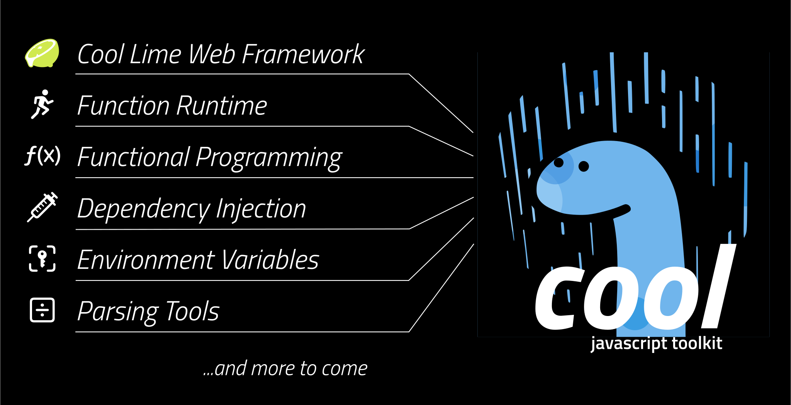

<p align="center">
  <a href="./">
    
  </a>
</p>

## 📖 Overview

`cool` is an ecosystem designed to promote best practices, a specific
philosophy, and enhanced portability across different platforms.

It is comprised of various sub-**component**s, each designed to work
harmoniously together, allowing developers to abstract their code for better
portability across different platforms. This encourages a functional programming
approach, enabling code to be written once and then run on various mainstream
environments such as CLI, bot platforms, cloud-function runtimes, and web APIs.

The reason we started to build this project is the feeling of a lack of a
JavaScript/TypeScript framework that is portable across web browsers, Deno,
Supabase, Netlify, AWS Lambda, and Cloudflare Workers. By adhering to WinterCG
guidelines and TC39 standards, we aim to provide a framework that is portable
across all these platforms.

## 🎯 Our Goal / The Bigger Picture

```js
import { Runtime, Context } from "$cool/runtime/mod.ts";

const home = (ctx: Context) => {
  return ctx.results.jsx(<h1>Hello there!</h1>);
};

const profile = (ctx: Context) => {
  const slug = ctx.input.param("id");
  const db = ctx.di`db`;

  ctx.logger.info(`Visiting the profile of ${slug}!`);

  return ctx.results.json(db.query("SELECT * FROM users WHERE slug=:slug", { slug }));
};

const router = (ctx: Context) => {
  switch (true) {
    case ctx.route.match("/"):
      return home(ctx);
    case ctx.route.match("/:id"):
      return profile(ctx);
    default:
      return ctx.results.notFound();
  }
};

const runtime = new Runtime();
runtime.ci.register("db", new DatabaseConnection());
runtime.listen(router); // or runtime.execute(fn);
```

## 📂 Component Set

| Component                         | Area              | Description                                         |
| --------------------------------- | ----------------- | --------------------------------------------------- |
| 📓 [cool/directives](directives/) | Rules             | The ground rules adhered to by the entire ecosystem |
| 📑 [cool/standards](standards/)   | Abstraction       | Provides common abstraction layers for DI           |
| ⚙️ [cool/di](di/)                  | Manager           | Dependency injection system                         |
| 🧱 [cool/fp](fp/)                 | Functions Library | Tools for functional programming                    |
| 🔐 [cool/dotenv](dotenv/)         | Manager           | Load configurations from environment                |
| 〰️ [cool/parsing](parsing/)       | Manager           | Parsing tools for various strings and streams       |

See the respective component page to figure out its specific usage.

## 🚀 Jumpstart

Ensure that [Deno](https://deno.land/) 1.36 or higher is installed on your
system first.

Install `cool cli` globally first, then create a new project:

```sh
$ deno install -A -n cool https://c00l.deno.dev

$ cool create my-cool-project

Creating "cool web project template 0.0.1" on my-cool-project...
...
done.
```

## 🙋🏻 FAQ

### Want to report a bug or request a feature?

If you find a bug, have a feature request, please check out
[our contribution guidelines](CONTRIBUTING.md) and report it using
[GitHub Issues](https://github.com/eser/cool/issues)!

### Want to contribute?

It is publicly open for any contribution. Bug fixes, new features and additional
components are welcome.

If you want to improve the ecosystem, please read through our
[CONTRIBUTING.md](CONTRIBUTING.md) to get started.

If you're not sure where to start, check out the
[issues](https://github.com/eser/cool/issues) labeled `good first issue` and
`help wanted`. We also recommend looking at closed ones to get a sense of the
kinds of issues you can tackle.

To contribute to codebase, fork the repo, push your changes to your fork, and
then submit a pull request.

### Requirements

- Deno 1.36 or higher (https://deno.land/)

### License

This project is licensed under the Apache 2.0 License. For further details,
please see the [LICENSE](LICENSE) file.

### To support the project...

[Visit my GitHub Sponsors profile at github.com/sponsors/eser](https://github.com/sponsors/eser)
