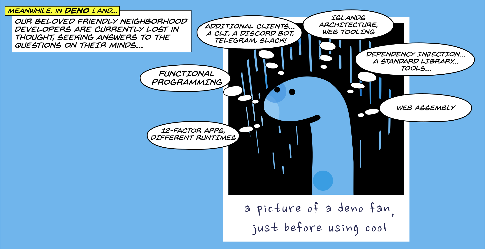

# `eserstack` - The Portability Solution for Your Code! 🚀

[](https://jsr.io/@eser)
[](https://codecov.io/gh/eser/stack)
[](https://github.com/eser/stack/actions/workflows/build.yml)
[](https://deno.land/std)

<p align="center">
  <a href="./">
    
  </a>
</p>

Step into a world where you never have to deal with portability and platform
issues. Whether you're targeting **web browsers**, **serverless platforms**,
**chatbots**, **CLI**, or multiple platforms simultaneously, eserstack ensures
**your code runs** flawlessly **everywhere**.

## 📖 Overview

`eserstack` is a JavaScript toolkit designed to uphold best practices and
enhance portability across different platforms.

Beyond being a toolkit, `eserstack` advocates for a philosophy that emphasizes
writing code driven by algorithms, design and patterns, not by platform-specific
implementation details.

While `eserstack` offers you a layer of abstraction that isolates you from the
platforms, **you can focus on your implementation**. Don't worry about the rest,
your solution will excel across diverse environments.

Every [component](#component-set) of `eserstack` is designed to work in harmony,
strives to offer you an intuitive and delightful development experience.

## 🌟 Why choose eserstack?

`eserstack` is meticulously designed for developers who:

- **Seek Portability**: If you've ever felt the need for a JavaScript/TypeScript
  framework that seamlessly works across web browsers, Deno, Supabase, Netlify,
  AWS Lambda and Cloudflare Workers, `eserstack` is your answer.
  [See the full list of supported platforms](#platform-support)

- **Love Functional Programming**: `eserstack` not only supports but encourages
  a functional programming approach. This means you can write your code once and
  run it on various platforms without modifications.
  [Dive into our functional programming tools](./fp/README.md)

- **Want Enhanced Testability**: With the removal of hard-coded dependencies and
  the promotion of loose coupling, `eserstack` enhances the testability of your
  codebase, ensuring that your applications run as expected.
  [Explore our dependency injection system](./di/README.md)

- **Desire a Unified Approach**: Instead of juggling multiple libraries and
  tools, `eserstack` provides a unified toolkit where each component works
  seamlessly with the others, ensuring a smoother development experience.
  [Check out our component set](#component-set)

- **Prioritize Best Practices**: If you've been struggling with maintaining best
  practices in your development process, `eserstack` is here to guide you. With
  built-in support for principles like 12factor and dependency injection, you
  can ensure that your code remains clean, maintainable, and scalable.
  [Learn more about our best practices approach](#best-practices)

## 📂 Components

### Component Set

#### Core

| Component                                    | Description                                                        | Latest Version                                                                    |
| -------------------------------------------- | ------------------------------------------------------------------ | --------------------------------------------------------------------------------- |
| 🧩 [@eser/primitives](pkg/@eser/primitives/) | Result types, Option, and base constructors                        | [](https://jsr.io/@eser/primitives) |
| 📑 [@eser/standards](pkg/@eser/standards/)   | Cross-runtime standards, formatters, i18n, and runtime abstraction | [](https://jsr.io/@eser/standards)   |
| ⚡ [@eser/functions](pkg/@eser/functions/)   | Monadic workflows, tasks, trigger adapters (CLI, HTTP, MCP)        | [](https://jsr.io/@eser/functions)   |
| 🧱 [@eser/fp](pkg/@eser/fp/)                 | Functional programming combinators                                 | [](https://jsr.io/@eser/fp)                 |
| ⚙️ [@eser/di](pkg/@eser/di/)                 | Dependency injection container                                     | [](https://jsr.io/@eser/di)                 |
| 📓 [@eser/directives](pkg/@eser/directives/) | Ground rules adhered to by the ecosystem                           | -                                                                                 |

#### Infrastructure

| Component                              | Description                                         | Latest Version                                                              |
| -------------------------------------- | --------------------------------------------------- | --------------------------------------------------------------------------- |
| 🔐 [@eser/config](pkg/@eser/config/)   | Load configurations from .env files and environment | [](https://jsr.io/@eser/config)   |
| 📢 [@eser/events](pkg/@eser/events/)   | Event bus and pub/sub system                        | [](https://jsr.io/@eser/events)   |
| 📝 [@eser/logging](pkg/@eser/logging/) | Hierarchical logging with OpenTelemetry integration | [](https://jsr.io/@eser/logging) |
| 💾 [@eser/cache](pkg/@eser/cache/)     | Caching abstractions                                | [](https://jsr.io/@eser/cache)     |
| 🌐 [@eser/http](pkg/@eser/http/)       | HTTP client and server utilities                    | [](https://jsr.io/@eser/http)       |
| 🐚 [@eser/shell](pkg/@eser/shell/)     | CLI framework, shell execution, and completions     | [](https://jsr.io/@eser/shell)     |
| 🔑 [@eser/crypto](pkg/@eser/crypto/)   | Cryptographic hashing via Web Crypto API            | [](https://jsr.io/@eser/crypto)   |

#### Data & Parsing

| Component                                  | Description                                                     | Latest Version                                                                  |
| ------------------------------------------ | --------------------------------------------------------------- | ------------------------------------------------------------------------------- |
| 〰️ [@eser/parsing](pkg/@eser/parsing/)     | Parsing tools for strings and streams                           | [](https://jsr.io/@eser/parsing)     |
| 🔄 [@eser/formats](pkg/@eser/formats/)     | Bidirectional format conversion (JSON, YAML, CSV, TOML, JSONL)  | [](https://jsr.io/@eser/formats)     |
| 🌊 [@eser/streams](pkg/@eser/streams/)     | Composable I/O streams with Span-based formatting and renderers | [](https://jsr.io/@eser/streams)     |
| ⚙️ [@eser/collector](pkg/@eser/collector/) | Module export collector and manifest generator                  | [](https://jsr.io/@eser/collector) |
| 🗄️ [@eser/cs](pkg/@eser/cs/)               | Config storage — Kubernetes ConfigMap/Secret sync               | [](https://jsr.io/@eser/cs)               |

#### Web & UI

| Component                                            | Description                                        | Latest Version                                                                            |
| ---------------------------------------------------- | -------------------------------------------------- | ----------------------------------------------------------------------------------------- |
| ⚛️ [@eser/jsx-runtime](pkg/@eser/jsx-runtime/)       | JSX runtime for server-side rendering              | [](https://jsr.io/@eser/jsx-runtime)       |
| ⚙️ [@eser/app-runtime](pkg/@eser/app-runtime/)       | Application lifecycle and module management        | [](https://jsr.io/@eser/app-runtime)       |
| 🌐 [@eser/laroux](pkg/@eser/laroux/)                 | Laroux.js framework-agnostic core                  | [](https://jsr.io/@eser/laroux)                 |
| 🖥️ [@eser/laroux-server](pkg/@eser/laroux-server/)   | Laroux.js HTTP server and SSR runtime              | [](https://jsr.io/@eser/laroux-server)   |
| ⚛️ [@eser/laroux-react](pkg/@eser/laroux-react/)     | Laroux.js React client runtime and hydration       | [](https://jsr.io/@eser/laroux-react)     |
| 📦 [@eser/laroux-bundler](pkg/@eser/laroux-bundler/) | Laroux.js build tooling, CSS, and asset processing | [](https://jsr.io/@eser/laroux-bundler) |
| 📦 [@eser/bundler](pkg/@eser/bundler/)               | General-purpose bundler utilities                  | [](https://jsr.io/@eser/bundler)               |

#### Tooling

| Component                                  | Description                                              | Latest Version                                                                  |
| ------------------------------------------ | -------------------------------------------------------- | ------------------------------------------------------------------------------- |
| 🔧 [@eser/codebase](pkg/@eser/codebase/)   | Codebase validation, scaffolding, and release management | [](https://jsr.io/@eser/codebase)   |
| 🔄 [@eser/workflows](pkg/@eser/workflows/) | Workflow engine for tool pipelines                       | [](https://jsr.io/@eser/workflows) |
| 📦 [@eser/registry](pkg/@eser/registry/)   | Recipe registry, distribution protocol, and handlers     | [](https://jsr.io/@eser/registry)   |
| 🖥️ [@eser/cli](pkg/@eser/cli/)             | Terminal client — kit, codebase, workflows, and more     | [](https://jsr.io/@eser/cli)             |
| 🧪 [@eser/testing](pkg/@eser/testing/)     | Testing utilities and helpers                            | [](https://jsr.io/@eser/testing)     |

Visit the respective component page for detailed usage instructions.

### Our Goal / The Bigger Picture

We strive to run the following code seamlessly across
[all platforms we support](#platform-support):

```js
import * as runtime from "@eser/runtime";

const home = (ctx: runtime.Context) => {
  return ctx.results.jsx(<h1>Hello there!</h1>);
};

const profile = (ctx: runtime.Context) => {
  const slug = ctx.input.param("id");
  const db = ctx.di`db`;

  ctx.logger.info(`Visiting the profile of ${slug}!`);

  return ctx.results.json(db.query("SELECT * FROM users WHERE slug=:slug", { slug }));
};

const router = (ctx: runtime.Context) => {
  switch (true) {
    case ctx.route.match("/"):
      return home(ctx);
    case ctx.route.match("/:id"):
      return profile(ctx);
    default:
      return ctx.results.notFound();
  }
};

const runtime = new runtime.Runtime();
runtime.ci.register("db", new DatabaseConnection());
runtime.listen(router); // or runtime.execute(fn);
```

### Platform Support

Since the reason we started to build this project is the feeling of a lack of a
JavaScript/TypeScript framework that is portable across many platforms, we're
always looking for the widen this list. By adhering to
[WinterCG guidelines](https://wintercg.org/) and
[TC39 standards](https://tc39.es/), we strive to provide a framework that is
portable across all these platforms.

- [x] Deno
- [ ] Node.js
- [x] Web Browsers
- [ ] Service Workers
- [x] Deno Deploy
- [ ] Cloudflare Workers
- [ ] Supabase Functions
- [ ] Netlify
- [ ] AWS Lambda
- [ ] Google Cloud Functions
- [ ] Azure Functions
- [ ] Telegram Bots
- [ ] Discord Bots
- [ ] Slack Bots

...and all other platforms that comply with the
[WinterCG guidelines](https://wintercg.org/).

## 🚀 Jumpstart

Ensure that [Deno](https://deno.land/) 2.4 or higher is installed on your system
first.

### Install the CLI

```bash
# Install script (macOS/Linux)
curl -fsSL https://eser.run/install | sh

# Or via npm
npm install -g eser

# Or run without installing
npx eser <command>
```

### Browse available recipes

```bash
$ eser kit list

PROJECTS
  library-pkg          Deno library package with tests and README
  laroux-app           Laroux.js web application with SSR and React
  go-service           Go microservice with hexagonal architecture
  ...

UTILITIES
  fp-pipe              Functional pipe and compose utilities
  ajan-httpfx          Ajan HTTP server framework
  ...
```

### Create a new project

```bash
$ eser kit new laroux-app --name my-site

✓ Created my-site with 14 file(s)
```

### Add a recipe to an existing project

```bash
$ eser kit add fp-pipe

✓ Added 1 file(s) from fp-pipe
  → lib/fp/pipe.ts
  ✓ deno add jsr:@eser/fp@^4.1.0
```

## Contributors

<!-- CONTRIBUTORS:START -->
<table>
  <tr>
    <td align="center"><a href="https://github.com/eser"><br /><sub>eser</sub></a></td>
    <td align="center"><a href="https://github.com/ayhansipahi"><br /><sub>ayhansipahi</sub></a></td>
    <td align="center"><a href="https://github.com/wralith"><br /><sub>wralith</sub></a></td>
  </tr>
</table>
<!-- CONTRIBUTORS:END -->

## 🙋🏻 FAQ

### Want to report a bug or request a feature?

If you're going to report a bug or request a new feature, please ensure first
that you comply with the conditions found under
[@eser/directives](https://github.com/eser/stack/blob/dev/pkg/directives/README.md).
After that, you can report an issue or request using
[GitHub Issues](https://github.com/eser/stack/issues). Thanks in advance.

### Want to contribute?

It is publicly open for any contribution from the community. Bug fixes, new
features and additional components are welcome.

If you're interested in becoming a contributor and enhancing the ecosystem,
please start by reading through our [CONTRIBUTING.md](CONTRIBUTING.md).

If you're not sure where to begin, take a look at the
[issues](https://github.com/eser/stack/issues) labeled `good first issue` and
`help wanted`. Reviewing closed issues can also give you a sense of the types of
contributions we're looking for and you can tackle.

If you're already an experienced OSS contributor, let's take you to the shortest
path: To contribute to the codebase, just fork the repo, push your changes to
your fork, and then submit a pull request.

### Requirements

- Deno 2.4 or higher (https://deno.land/)

### Versioning

This project follows [Semantic Versioning](https://semver.org/). For the
versions available, see the
[tags on this repository](https://github.com/eser/stack/tags).

### License

This project is licensed under the Apache 2.0 License. For further details,
please see the [LICENSE](LICENSE) file.

### To support the project...

[Visit my GitHub Sponsors profile at github.com/sponsors/eser](https://github.com/sponsors/eser)
